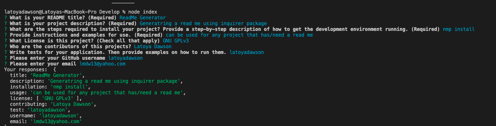

# README Generator 

[How to create a Professional README](./readme-guide.md)

## Description
A node.js application that uses user input from inquirer to populate a README.md file for user repository. The README.md file is created in the dist directory and can be found [here](/develop/exampleREADME.md). The application utilizes modularization by separating the inquier call and generation of the markdown into separate modules: index js and generateMarkdown.js, respectively, inside the utils folder.

The application also utilizes, as much as possible, syntax and paradigms introduced in ES6 , including arrow functions, const, let, template literals, and async/await to handle the inquirer and fs.writeFile promises.

## Table of Contents
* [User Story](#UserStory)
* [Acceptance Criteria](#acceptanceCriteria)
* [Installation](#installation)
* [Usage](#usage)

## User Story
AS A developer
I WANT a README generator
SO THAT I can quickly create a professional README for a new project

## Acceptance Criteria 
GIVEN a command-line application that accepts user input
WHEN I am prompted for information about my application repository
THEN a high-quality, professional README.md is generated with the title of my project and sections entitled Description, Table of Contents, Installation, Usage, License, Contributing, Tests, and Questions
WHEN I enter my project title
THEN this is displayed as the title of the README
WHEN I enter a description, installation instructions, usage information, contribution guidelines, and test instructions
THEN this information is added to the sections of the README entitled Description, Installation, Usage, Contributing, and Tests
WHEN I choose a license for my application from a list of options
THEN a badge for that license is added near the top of the README and a notice is added to the section of the README entitled License that explains which license the application is covered under
WHEN I enter my GitHub username
THEN this is added to the section of the README entitled Questions, with a link to my GitHub profile
WHEN I enter my email address
THEN this is added to the section of the README entitled Questions, with instructions on how to reach me with additional questions
WHEN I click on the links in the Table of Contents
THEN I am taken to the corresponding section of the README

## Installation
To generate your own README, first run npm install in order to install the following npm package dependencies as specified in the package.json:

  * inquirer that will prompt you for your inputs from the command line

## Usage
Run the following command at th root of your project and answer the prompted questions: node index.js

## Contribution
Made with ❤️  by Latoya Dawson

